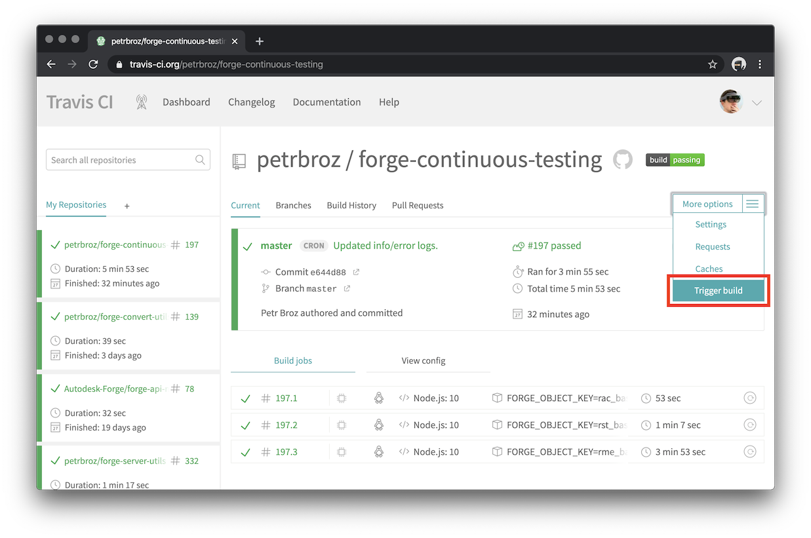
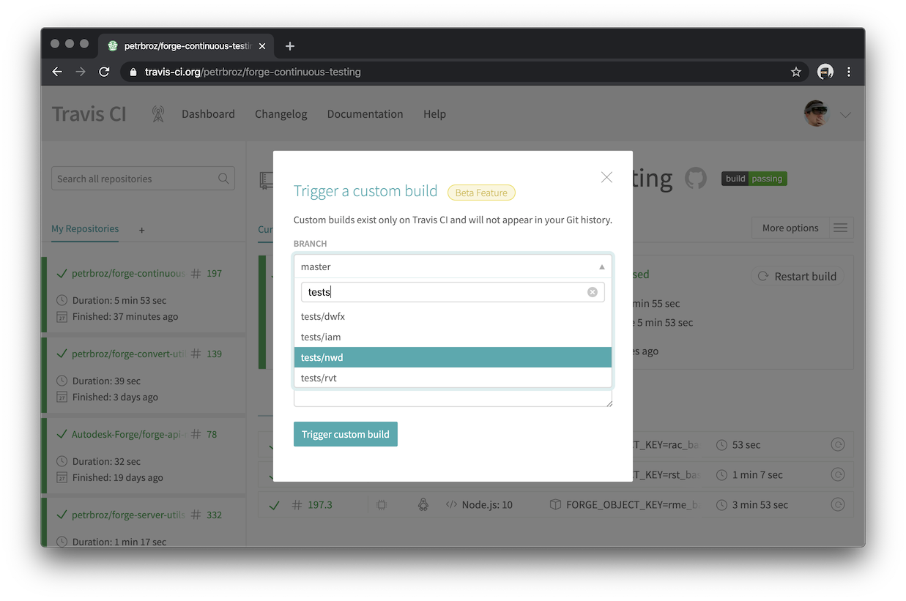
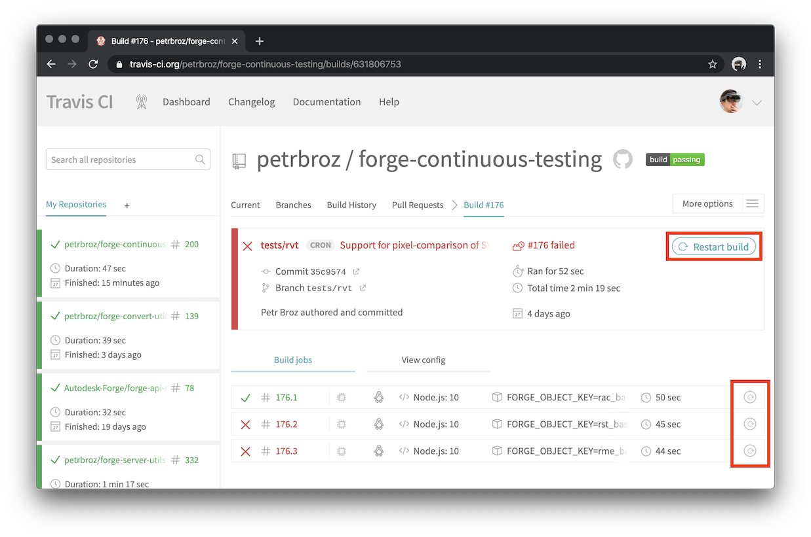
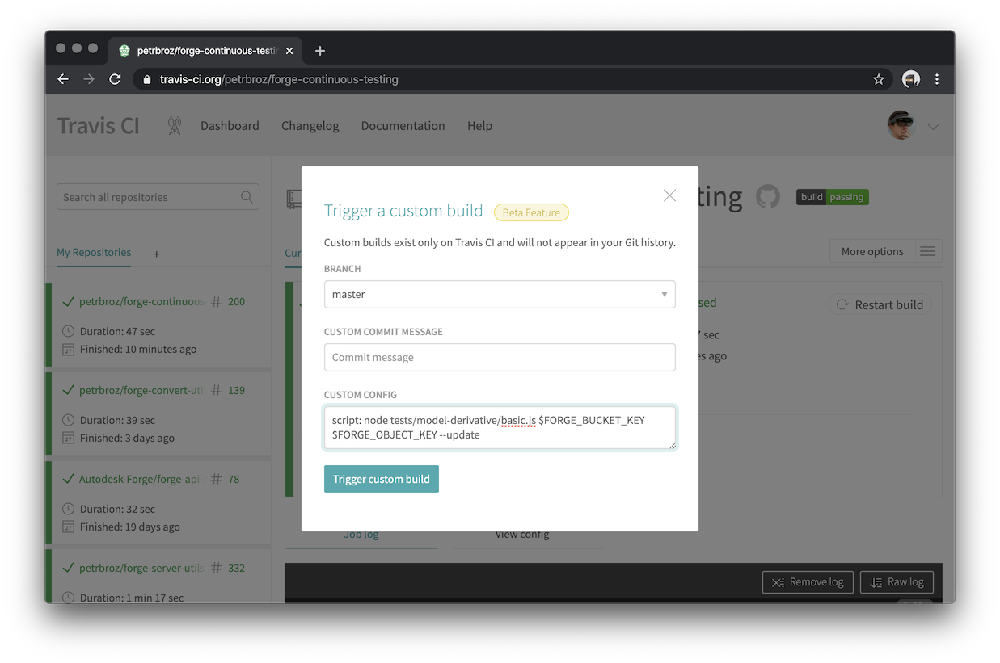

# forge-continuous-testing

> Experimental automated testing of [Autodesk Forge](https://forge.autodesk.com) services using [Travis CI](https://travis-ci.org).

| Branch      | Status |
|-------------|--------|
| master      | [](https://travis-ci.org/petrbroz/forge-continuous-testing) |
| tests/rvt   | [](https://travis-ci.org/petrbroz/forge-continuous-testing) |
| tests/iam   | [](https://travis-ci.org/petrbroz/forge-continuous-testing) |
| tests/dwfx  | [](https://travis-ci.org/petrbroz/forge-continuous-testing) |
| tests/nwd   | [](https://travis-ci.org/petrbroz/forge-continuous-testing) |

## How To

> Note: most of the following actions can only be taken by collaborators of this github repo.
> If you're not a collaborator yet, ask the admin of this repo to be invited.

### Manually triggering a new test

Go to https://travis-ci.org/petrbroz/forge-continuous-testing, and choose the _Trigger build_ option in the _More options_ menu:



Find the branch you want to test, and start the test using the _Trigger custom build_ button.

> Currently we're testing different types of file formats in their own branches (so that they can run as separate builds/jobs in Travis).
> For example, the _tests/rvt_ branch configures a couple of sample Revit models in the _.travis.yml_ config file.



### Manually restarting a test

Go to https://travis-ci.org/petrbroz/forge-continuous-testing/builds, and find the failing build/test.
On the build page you can choose to restart the entire build using the _Restart build_ button, or just
some of the build "jobs" (representing individual sample files of the tested file format):



### Updating a test baseline

Follow the same steps as when manually triggering a new test, but customize the config to pass the `--update` flag
to the test script. Currently the only test available is _tests/model-derivative/basic.js_ (accepting a bucket key
and an object key as its two parameters), so the modified config would look like this:

```
script: node tests/model-derivative/basic.js $FORGE_BUCKET_KEY $FORGE_OBJECT_KEY --update
```



### Skipping tests when updating the code

If you want to skip a build when submitting code changes, use `[skip travis]` or a [similar phrase](https://docs.travis-ci.com/user/customizing-the-build/#skipping-a-build) in your commit message.
